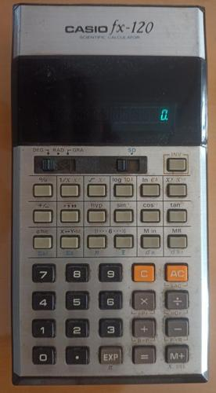
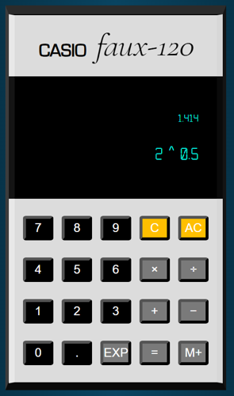

# calculator

<!--   -->

{style="display: block; margin: 0 0 0 auto"} {style="display: block; margin: 0 auto 0 0"} 

---

## How This Calculator Works

This calculator has a top and a bottom row in its display. The top row shows the answer, and the bottom row shows the current operation. For any operation to take place, two terms and an operator must be present in the bottom row. If this condition is met, pressing the equals button will yield the answer in the top row, and pressing an operator button will compute the result and use it in the new calculation.

The display is such that 21 symbols fit in the bottom row. Due to this constraint, and the fact that the decimal precision is set to 3 digits after the decimal point, the first term in any operation must be at most 17 symbols long. The remaining four digits will be a space, an operator, a space, and a one digit number. Another consequence of this fact is that, since the decimal part is 4 symbols long (the period plus the 3 digits), then the integer part of the number can be at most 13 symbols for positive numbers and 12 symbols for negative numbers (the minus sign uses an additional space). Any operation resulting in a positive number with more than 13 digits in its integer part, or more than 12 digits in its integer part if the number is negative, will yield `Inf` / `-Inf` in the top row.

An [exponentiation operation](https://developer.mozilla.org/en-US/docs/Web/JavaScript/Reference/Operators/Exponentiation) that yields `NaN`, `Infinity`, or `-Infinity` in JavaScript will lead to an error message being shown in the top row.

The Clear (C) button will remove the second term from the second row, and the All Clear (AC) button will reset the display to its initial condition.